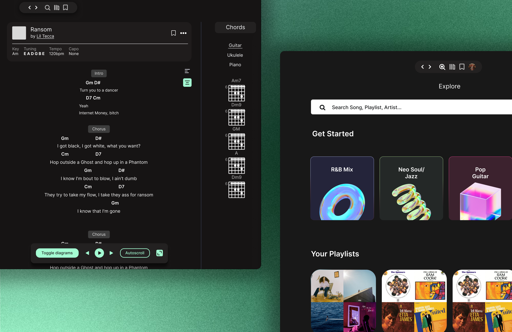

# Spotitabs 🎸

A guitar-learning tool that turns songs you already listen to into an interactive practice experience.

Spotitabs connects to a user's Spotify library and brings playback, chords, tabs, lyrics, key, and BPM into one synchronized interface so guitarists can learn songs without constantly switching between different tools.

> Designed and built from initial user research and Figma prototypes through frontend implementation and API integration.

## Preview

<!-- Add your best screenshot or GIF here -->



## Why I Built It

When learning songs on guitar, I found myself constantly jumping between Spotify, chord websites, tabs, lyrics, and other tools.

I wanted to explore a simpler question:

**What if the song itself became the learning interface?**

I spoke with guitar learners across different skill levels and found similar friction around:

- switching between playback and learning resources
- finding accurate song information
- keeping tabs or chords synchronized with the music
- navigating multiple tools while actively practicing

Spotitabs was my attempt to bring that workflow into one focused experience.

## Core Experience

Users can:

- Connect their Spotify library
- Select songs they already listen to
- View synchronized chords, tabs, and lyrics
- See song metadata including key and BPM
- Control playback without leaving the learning interface
- Move between songs while preserving a consistent practice workflow

## Design Process

I explored the product through **4 interactive Figma prototypes**, testing different approaches to navigation, visual hierarchy, and playback controls.

Early versions separated playback and learning content too aggressively, which made the experience feel like several tools placed on the same page rather than one cohesive product.

I iterated toward a layout where playback remains persistent while learning content becomes the primary focus.

The final direction prioritizes:

**song → playback → learning content → controls**

rather than exposing every available feature at once.

## Technical Architecture

Spotitabs is built with **Next.js and TypeScript** and integrates external music services to combine playback and song-learning information into a single interface.

```text
Spotify
   │
   ├── User library / playlists
   ├── Track metadata
   └── Playback context
          │
          ▼
      Spotitabs
     Next.js UI
          │
     ┌────┴─────┐
     ▼          ▼
 Song data    Audio /
 metadata     analysis
     │          │
     └────┬─────┘
          ▼
 Chords · Tabs · Lyrics
      Key · BPM
